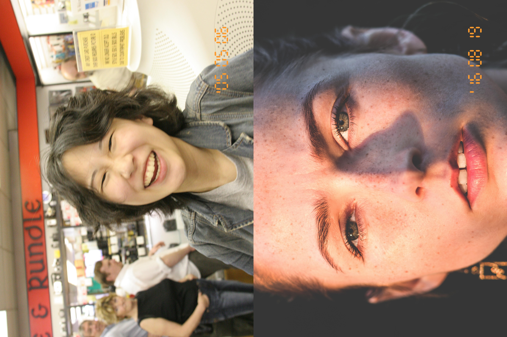

# Retro 2x3 Photos Side by Side

Add retro style date to photos and merge pairs side by side for printing on 4"x6" photos.



## Installation
You'll need the Python [Pillow library](https://python-pillow.org/) to run the script. I suggest using a Conda environment. For example, you can create a Conda environment by running the following in the project directory:
```bash
conda env create -f env.yml
```

Then activate the environment using:
```bash
conda activate retro_photos
```

## Run

Before running the script add photos to `photos/` directory.

> [!NOTE]
> Photos are sorted by number.

Then run `app.py`:
```bash
python app.py
```

The photos should be placed in a directory called `output/` in the project directory.

## Licensing
Unless otherwise specified: GNU General Public License v3.0 (GPL-3.0)

`calculatrix-7.ttf`: Creative Commons Zero (CC0)  
`photos/29047364532_ebe7e56e37_o.jpg`: Creative Commons Zero (CC0)  
`photos/12609583_f2bb69ed83_o.jpg`: Creative Commons Zero (CC0)  